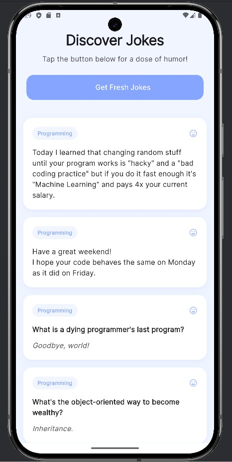
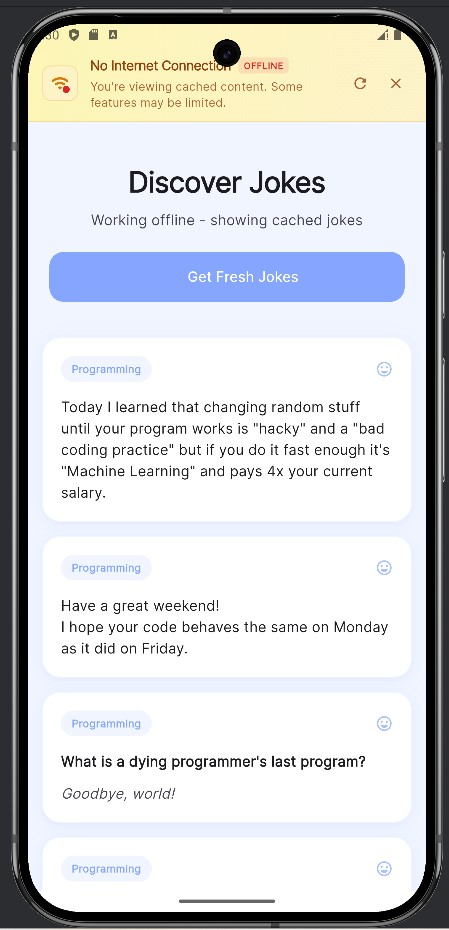
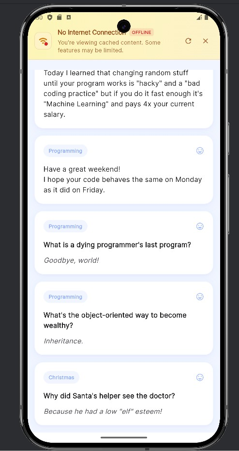

# Cached Jokes App

A Flutter-based mobile application that fetches and displays jokes with offline support using shared_preferences for caching. The app maintains a collection of 5 jokes that are accessible both online and offline, providing a seamless user experience regardless of network connectivity.

## Features

- Fetches 5 random jokes from JokeAPI
- Caches jokes locally using shared_preferences
- Works in both online and offline modes
- Clean and intuitive user interface
- Proper JSON serialization/deserialization
- Automatic cache management
- Network status detection

## Technical Specifications

### Prerequisites
- Flutter SDK (version: 3.24.3 or higher)
- Dart SDK (version 3.5.3 or higher)
- Android Studio or VS Code with Flutter extensions
- Physical device or emulator for testing

### Dependencies
```yaml
dependencies:
  flutter:
    sdk: flutter
  shared_preferences: ^2.2.2
  http: ^1.1.0
  connectivity_plus: ^5.0.1
```

## Installation

1. Clone the repository:
```bash
git clone https://github.com/yourusername/cached_jokes_app.git
```

2. Navigate to project directory:
```bash
cd cached_jokes_app
```

3. Install dependencies:
```bash
flutter pub get
```

4. Run the app:
```bash
flutter run
```

## Architecture

The app follows a clean architecture pattern with the following components:

- **Data Layer**: Handles API calls and local storage using shared_preferences
- **Domain Layer**: Contains business logic and data models
- **Presentation Layer**: Manages UI and state management

## Key Features Implementation

### Joke Caching
- Uses shared_preferences to store jokes locally
- Implements automatic cache updates when online
- Maintains exactly 5 jokes at all times

### Offline Support
- Checks network connectivity status
- Serves cached jokes when offline
- Seamlessly switches between online/offline modes

### API Integration
- Makes GET requests to jokes API
- Handles API response parsing
- Implements proper error handling

## Screenshots





## Running Tests

Execute the following commands to run tests:

```bash
flutter test
```

## Error Handling

The app implements comprehensive error handling for:
- Network connectivity issues
- API failures
- Cache reading/writing errors
- JSON parsing exceptions
